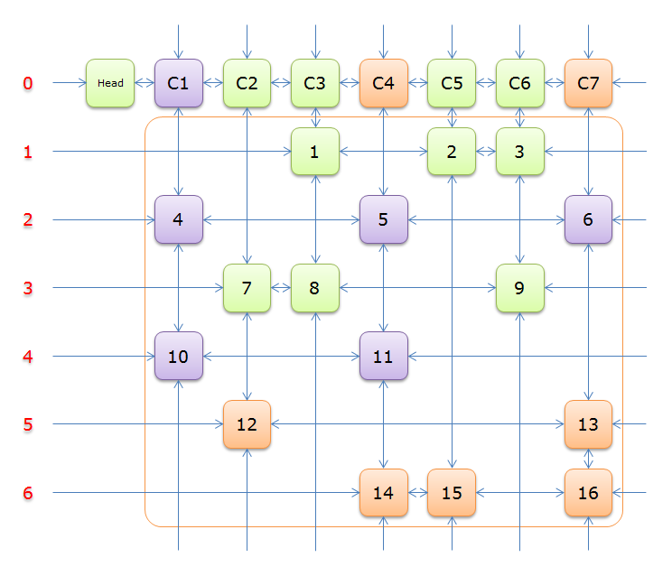

# 数独求解 go语言版

源代码`github`地址：[https://github.com/smilelc3/sudoku-solver](https://github.com/smilelc3/sudoku-solver)

关于数独`wiki`介绍：[https://zh.wikipedia.org/wiki/%E6%95%B8%E7%8D%A8](https://zh.wikipedia.org/wiki/%E6%95%B8%E7%8D%A8)

一个数独样例
```text
+-----------------------------+
|       5 | 3       |         |
| 8       |         |    2    |
|    7    |    1    | 5       |
|---------+---------+---------|
| 4       |       5 | 3       |
|    1    |    7    |       6 |
|       3 | 2       |    8    |
|---------+---------+---------|
|    6    | 5       |       9 |
|       4 |         |    3    |
|         |       9 | 7       |
+-----------------------------+
```


## 规则
> 游戏一般由9个3×3个的九宫格组成。  
> 每一列的数字均须包含 1～9，不能缺少，也不能重复。  
> 每一行的数字均须包含 1～9，不能缺少，也不能重复。  
> 每一宫(粗黑线围起来的区域，通常是 3*3 的九宫格)的数字均须包含 1～9，不能缺少，也不能重复。 


## 算法介绍

实现了两种求数独的算法：
1. 基于摈弃原则的深度优先搜索算法(dfs)
2. 优化的舞蹈链算法(Dance Links X)

### 一、基于摈弃原则的深度优先搜索算法

#### 说明

计算流程如下：


一般正常数独耗时<10ms，算法主要是深度优先搜索，但是做了几点优化：

1. 优先填写唯一解的单元格
2. 下一次搜索节点为全局可能性最小单元格（近似贪心）

#### 补充
* 其实可以做二进制编码优化，时间复杂度降低一个数量级。但主要是为了代码易读，并非为了极致时间效率；

### 二、优化的舞蹈链算法



* 舞蹈链算法介绍见博客：[跳跃的舞者，舞蹈链（Dancing Links）算法——求解精确覆盖问题](https://www.cnblogs.com/grenet/p/3145800.html)

* 优化思路来自于博客：[算法实践——舞蹈链（Dancing Links）算法求解数独](https://www.cnblogs.com/grenet/p/3163550.html)

主要优化有三点：

1. 提前优先处理唯一单元格
2. 优先标记最小可能舞蹈链列元素，极大降低了递归深度（近似贪心）
3. 先把有数字的格子转换为舞蹈链行，插入到矩阵中，便于计算时优先选中，且仅插入规则合法行，以便减少迭代次数


## 测试与对比
[test](test) 文件夹中，含有各种测试样例，包含号称
[最难数独](https://baike.baidu.com/item/%E4%B8%96%E7%95%8C%E6%9C%80%E9%9A%BE%E6%95%B0%E7%8B%AC/13848819) 样例文件[7hardest](test/7hardest)

测试结果基于400次重复求解用时均值，仅具有一定参考

| 样例文件  | 深度优先搜索算法 | 舞蹈链算法 | 备注           |
| :------- | :--------------: | :--------: | :------------: |
| 0finished |       0 ms       |  0.557 ms  | 已完成的数独   |
|  1dream   |     3.027 ms     |  2.904 ms  | 全空           |
|  2easier  |     0.010 ms     |  0.567 ms  | 仅一个位置未填 |
|   3easy   |     0.750 ms     |  0.840 ms  |                |
|  4normal  |     12.16 ms     |  1.452 ms  |                |
|   5hard   |     0.829 ms     |  1.060 ms  |                |
|  6harder  |     3.871 ms     |  1.239 ms  |                |
| 7hardest  |    189.212 ms    | 18.623 ms  | 号称最难数独   |

* 在某些特殊情况下，深度优先搜索深度低，在较为简单的数独上效率高；
* 舞蹈链算法稳定高效，适用于精确覆盖类问题，用额外的空间开销与特殊的数据结构，在复杂数独上效果显著。

### 最难数独运行程序结果
```text
+-----------------------------+
| 8       |         |         |
|       3 | 6       |         |
|    7    |    9    | 2       |
|---------+---------+---------|
|    5    |       7 |         |
|         |    4  5 | 7       |
|         | 1       |    3    |
|---------+---------+---------|
|       1 |         |    6  8 |
|       8 | 5       |    1    |
|    9    |         | 4       |
+-----------------------------+
已读取数独 test/7hardest
+-----------------------------+
| 8  1  2 | 7  5  3 | 6  4  9 |
| 9  4  3 | 6  8  2 | 1  7  5 |
| 6  7  5 | 4  9  1 | 2  8  3 |
|---------+---------+---------|
| 1  5  4 | 2  3  7 | 8  9  6 |
| 3  6  9 | 8  4  5 | 7  2  1 |
| 2  8  7 | 1  6  9 | 5  3  4 |
|---------+---------+---------|
| 5  2  1 | 9  7  4 | 3  6  8 |
| 4  3  8 | 5  2  6 | 9  1  7 |
| 7  9  6 | 3  1  8 | 4  5  2 |
+-----------------------------+
深度优先搜索法所用时间： 189.9914 ms
+-----------------------------+
| 8  1  2 | 7  5  3 | 6  4  9 |
| 9  4  3 | 6  8  2 | 1  7  5 |
| 6  7  5 | 4  9  1 | 2  8  3 |
|---------+---------+---------|
| 1  5  4 | 2  3  7 | 8  9  6 |
| 3  6  9 | 8  4  5 | 7  2  1 |
| 2  8  7 | 1  6  9 | 5  3  4 |
|---------+---------+---------|
| 5  2  1 | 9  7  4 | 3  6  8 |
| 4  3  8 | 5  2  6 | 9  1  7 |
| 7  9  6 | 3  1  8 | 4  5  2 |
+-----------------------------+
舞蹈链法所用时间： 20.0401 ms

Process finished with exit code 0
```