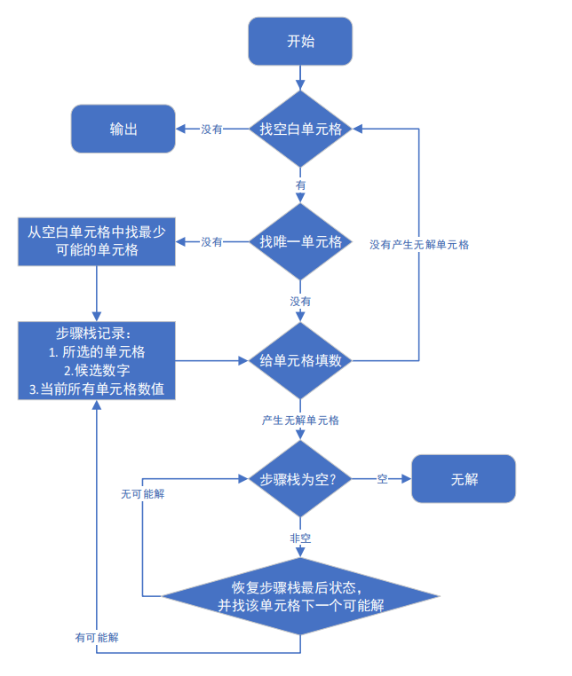

# 数独求解 go语言版

数独wiki
[https://zh.wikipedia.org/wiki/%E6%95%B8%E7%8D%A8](https://zh.wikipedia.org/wiki/%E6%95%B8%E7%8D%A8)

一个数独样例
```text
+-----------------------------+
|       5 | 3       |         |
| 8       |         |    2    |
|    7    |    1    | 5       |
|---------+---------+---------|
| 4       |       5 | 3       |
|    1    |    7    |       6 |
|       3 | 2       |    8    |
|---------+---------+---------|
|    6    | 5       |       9 |
|       4 |         |    3    |
|         |       9 | 7       |
+-----------------------------+
```


## 规则
> 游戏一般由9个3×3个的九宫格组成。  
> 每一列的数字均须包含 1～9，不能缺少，也不能重复。  
> 每一行的数字均须包含 1～9，不能缺少，也不能重复。  
> 每一宫(粗黑线围起来的区域，通常是 3*3 的九宫格)的数字均须包含 1～9，不能缺少，也不能重复。 


## 算法介绍
一般正常数独耗时~10ms，算法主要是深度优先搜索，但是做了几点优化：
1. 优先填写唯一解的单元格
2. 下一次搜索节点为全局可能性最小单元格（类贪心）

### 流程图


### 补充
* 其实可以做二进制编码优化，时间复杂度低一个数量级。但主要是为了代码易读，并非为了极致时间效率
* 舞蹈链（dance links）算法可解决精确覆盖问题，可用于速度求解，但搜索算法已相当快(1-200ms)，暂不更新


## 运行程序实例
`test`文件夹中，含有各种测试样例，包含号称
[最难数独](https://baike.baidu.com/item/%E4%B8%96%E7%95%8C%E6%9C%80%E9%9A%BE%E6%95%B0%E7%8B%AC/13848819) 样例`hardest1`文件

最难数独运行程序结果
```text
+-----------------------------+
| 8       |         |         |
|       3 | 6       |         |
|    7    |    9    | 2       |
|---------+---------+---------|
|    5    |       7 |         |
|         |    4  5 | 7       |
|         | 1       |    3    |
|---------+---------+---------|
|       1 |         |    6  8 |
|       8 | 5       |    1    |
|    9    |         | 4       |
+-----------------------------+
已找到解
+-----------------------------+
| 8  1  2 | 7  5  3 | 6  4  9 |
| 9  4  3 | 6  8  2 | 1  7  5 |
| 6  7  5 | 4  9  1 | 2  8  3 |
|---------+---------+---------|
| 1  5  4 | 2  3  7 | 8  9  6 |
| 3  6  9 | 8  4  5 | 7  2  1 |
| 2  8  7 | 1  6  9 | 5  3  4 |
|---------+---------+---------|
| 5  2  1 | 9  7  4 | 3  6  8 |
| 4  3  8 | 5  2  6 | 9  1  7 |
| 7  9  6 | 3  1  8 | 4  5  2 |
+-----------------------------+
所用时间 185 ms

Process finished with exit code 0

```